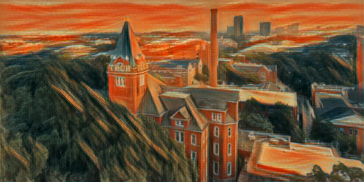

# Neural Style Transfer with OpenCV

Credit:
  - Adrian Rosebrock
  - https://www.pyimagesearch.com/2018/08/27/neural-style-transfer-with-opencv/
 
 
### Overview
Applies neural style transfer to images and videos(real-time using webcam). The models are trained by Johnson et al., as outlined in their paper [*Perceptual Losses for Real-Time Style Transfer and Super-Resolution*](https://cs.stanford.edu/people/jcjohns/eccv16/). The original algorithm was first described by Gatys et al. in their paper, [*A Neural Algorithm of Artistic Style*](https://arxiv.org/abs/1508.06576).

Neural style transer takes 2 images:
1. A style image
2. A content (or input) image
The idea is to take the style of the first image, and apply it to the second image. This results in an output image, which is very similar to the second image, but has the stylistic features of the first image.

An example is shown:

Original Image (Tech Tower, Georgia Tech): 

Syled Image (Styled, using Edvard Munch's [*The Scream*](https://www.edvardmunch.org/the-scream.jsp): 

**Running style transfer on one image**  
    $ python neural_style_transfer.py --image images/jurassic_park.jpg --model models/instance_norm/the_scream.t7

**Running style transfer on webcam video**  
    $ python neural_style_transfer_video.py --models models 
    - Press 'N' to go to next style 
    - Press 'P' to go to previous style
    - Press 'A' to save the actual image (in screenshots folder)
    - Press 'S' to save the styled image
    - Press 'B' to save both (actual and styled iamges)
    - Press 'Q' to quit 

**Running all style transfers on one image**  
    $ python neural_style_transfer_examine.py --models models --image images/giraffe.jpg 
    - Press any key to change style and generate another image

